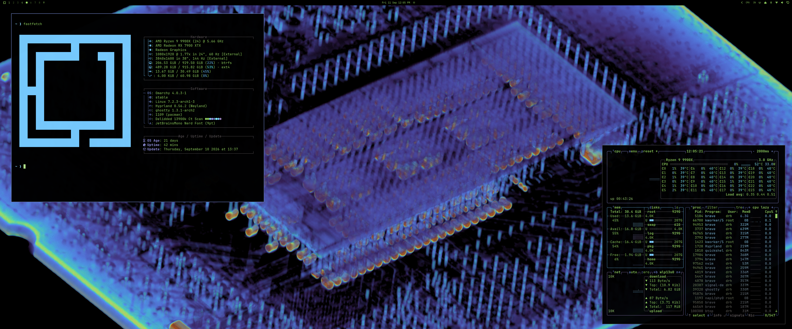

# CPU Skeleton Theme

## Preview

An Omarchy theme built around a Lumafield CT Scan of a delidded Intel 13900k from [LTT Labs](https://www.lttlabs.com/articles/2024/10/31/spooky-scary-skeleton-insides-of-a-cpu).

## Installation

Press `Super` + `Space` then go to `install` -> `style` -> `theme` and paste this repo's url: `https://github.com/midnightslicer/omarchy-cpu-skeleton-theme.git`

